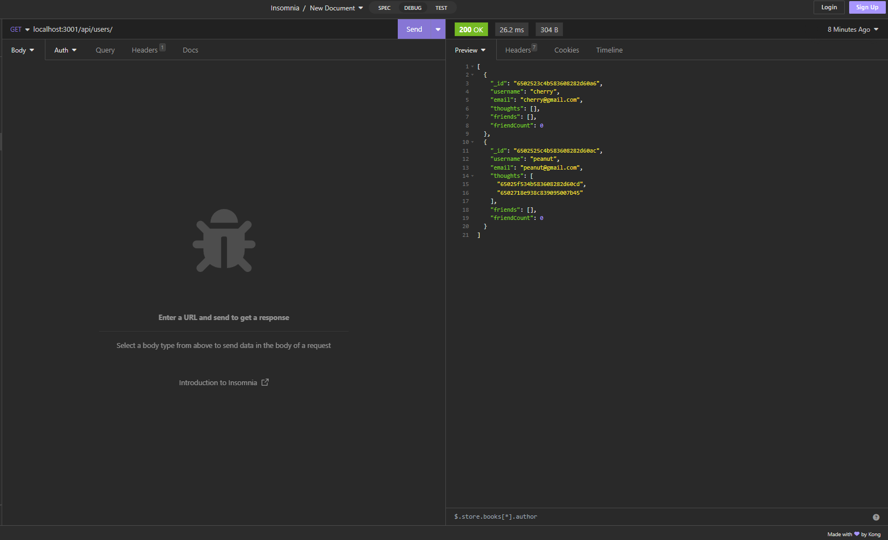

# SocialNetworkAPI

## Description

A small project designed mimic social media sites with the simplest functions

## Installation

Before downloading the repository, make sure you have MongoDB installed since this uses it was a database. After that and the repository has been download, run `npm install` to install dependencies.

## Usage

To start, run `npm run start` to start the server. Then you can access the api by using HTTP requests or software like Insomnia. Refer to the API routes and models to see what calls to make.

## Credits

ChatGPT for code bugfix assistance

## License

N/A

---